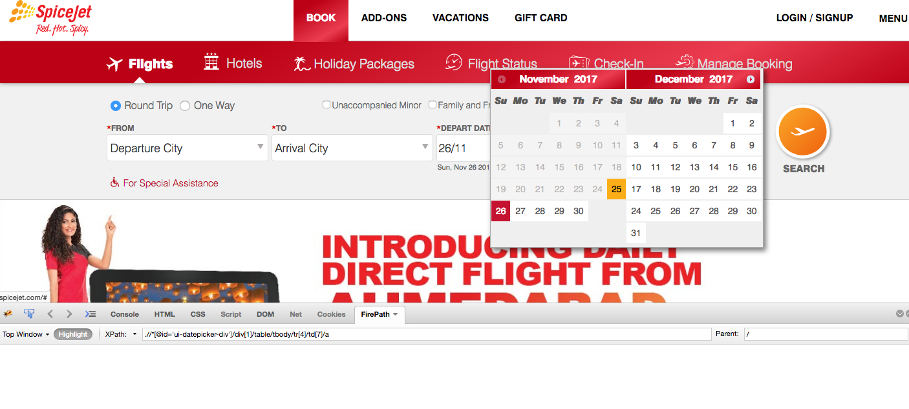

When I clicked Date 25 FROM DATE PICKER and checked the Xpath, this is what I got.

`.//*[@id='ui-datepicker-div']/div[1]/table/tbody/tr[4]/td[7]/a`

It is selecting 4th row, 7th column Which is 25.

Now if I use this Xpath and run the script today, it works.

`Browser.click(“xpath=.//*[@id='ui-datepicker-div']/div[1]/table/tbody/tr[4]/td[7]/a");`

But if I run this script tomorrow, it will try to select date 25, but that date will be disabled tomorrow (as its past). Then it gives an error.

My question is how do I select the right tr[?]/td[?] based on current date in the script.
